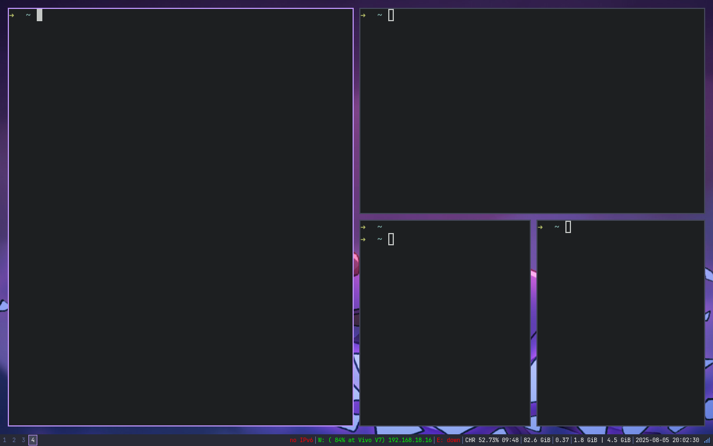
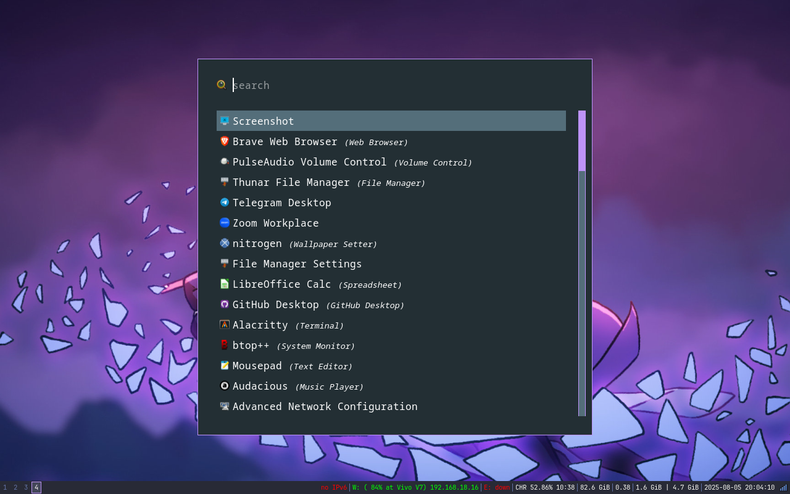

## My Development Environment as Code

<p align="center">
<a href="#"></a>
<a href="#"></a>
<a href="#"></a>
</p>

<p align="center">
A blueprint for a minimal, efficient, and reproducible development environment, managed entirely as code (<i>Infrastructure as Code</i>).
</p>

This repository contains all the configuration files (*dotfiles*) and automation scripts to build my i3wm-based work environment from scratch on any new machine. The goal is to create a fast, distraction-free, and consistent workflow everywhere.

## 🖼️ Preview

| Desktop View (Clean) | Rofi Launcher |
| :----------------------: | :-------------: |
|  |  |

## Philosophy

* **Eficiency Above All**
* **Automation**
* **Reproducibility**
* **Minimalism**

## 🛠️ Core Components

| Component        | Description                                       |
| :--------------- | :------------------------------------------------ |
| **Window Manager** | `i3` - An efficient tiling window manager.   |
| **Terminal** | `Alacritty` - A GPU-accelerated terminal emulator. |
| **App Launcher** | `Rofi` - A versatile application launcher and switcher. |
| **File Manager** | `Thunar` - A lightweight and functional file manager. |
| **System Lock** | `i3lock-fancy` - A script to lock the screen with a blur effect. |
| **Fonts** | `Nerd Fonts` - To display icons and glyphs in the terminal. |

---

## 🚀 Automated Installation

The entire installation process is handled by a script to ensure consistency and ease of use.

### Step 1: Prerequisites

Ensure `git` is installed. The following command will install other required dependencies on a **Debian/Ubuntu** based distribution.

```bash
sudo apt update && sudo apt upgrade
sudo apt install git i3 alacritty rofi thunar nitrogen i3lock-fancy xfce4-screenshooter nm-applet
```

You **must** also install a `JetBrainsMono Nerd Font`. Follow the instructions from the official repository:
* [Nerd Fonts Installer](https://github.com/officialrajdeepsingh/nerd-fonts-installer)

### Step 2: Clone the Repository

```bash
git clone https://github.com/risyady/dotfiles-i3wm.git
cd dotfiles-i3wm
```

### Step 3: Run the Installer Script

Grant execute permissions to the script, then run it. This script will handle backups, symlink creation, and other configurations.

```bash
chmod +x install.sh
```

You can run the script with several options:

* **For a new installation:**
```bash
./install.sh
```
* **To force a re-installation:** (Useful after a `git pull` to get updates)
```bash
./install.sh --reinstall
```
* **To uninstall:** (Removes symlinks and restores backups)
```bash
./install.sh --uninstall
```
* **To view the help menu:**
```bash
./install.sh --help
```

Running `./install.sh --help` will display:
```
Usage: ./install.sh [OPTION]

A script to manage the installation of Risyady's dotfiles.

Options:
  -r, -f, --reinstall, --force    Force reinstall all configurations.
  -u, --uninstall                 Uninstall all configurations and restore backups.
  -h, --help                      Display this help and exit.

If no option is provided, the script will run a fresh installation.
```

## 🔌 Post-Installation

After the installation is complete, **Logout** from your current session. On the login screen, choose **i3** as your desktop session before logging back in.

To reload the i3 configuration without logging out, use the shortcut: `$Mod + Shift + r`

## ⌨️ Key Keybindings

This configuration uses the **Windows (Super)** key as the `$Mod` key.

| Shortcut                | Action                                  |
| :---------------------- | :-------------------------------------- |
| `$Mod + Return`         | Open Terminal (Alacritty)               |
| `$Mod + d`              | Open Rofi (Application Launcher)        |
| `$Mod + Shift + f`      | Open Thunar (File Manager)              |
| `$Mod + Shift + s`      | Open Screenshooter                      |
| `$Mod + x`              | Lock i3 (i3lock-fancy)                  |
| `$Mod + Arrow (←↑↓→)`   | Change window focus                     |
| `$Mod + Shift + Arrow`  | Move focused window                     |
| `$Mod + r`              | Resize focused window                   |
| `$Mod + Shift + q`      | Close the focused window                |
| `$Mod + [0-9]`          | Switch to workspace 1-10                |
| `$Mod + Shift + [0-9]`  | Move focused window to workspace 1-10   |
| `$Mod + Shift + r`      | Reload i3 configuration                 |
| `$Mod + Shift + c`      | Reload system configuration             |
| `$Mod + Shift + e`      | Exit i3 (Menu for Logout)               |

*For a complete list of all keybindings, please refer to the `i3/config` file.*

## 🗺️ Roadmap

This repository is under continuous development. Future plans include:
* [ ] **Neofetch:** Integration of a custom system info script.
* [ ] **Greenclip:** Addition of a clipboard manager.
* [ ] **CI/CD:** Adding a GitHub Action to lint shell scripts (`shellcheck`).

## 🤝 Contributing

Suggestions and contributions are highly welcome. Please open an issue to report a bug or request a feature. Pull requests are also appreciated.

## 📜 License

This project is licensed under the [MIT License](LICENSE).